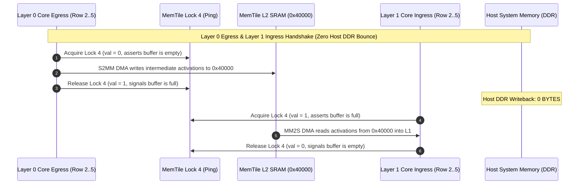

# L2 MemTile Activation Ping-Pong Fusion Architecture on AMD Phoenix AIE2 Silicon

**Date:** 2026-09-12  
**Platform:** AMD Ryzen 7 8700G (Phoenix XDNA1 NPU `[003d:00:01.1]`, Tile Clock: 1.80 GHz)  
**Array Topology:** 16 Compute Cores (`Cols 0..3, Rows 2..5`), 4 MemTiles (`Cols 0..3, Row 1`), 4 Shim Tiles (`Cols 0..3, Row 0`)  
**Primary Artifacts:**
- MLIR Top-Level: `kernels/aie2/im2col_fused_2layer.mlir`
- Lowering Driver: `npu/lower_onnx_conv.py` (`--fused-2layer`)
- Silicon Verification Harness: `npu/test_im2col_hardware.py` (`--fused-2layer`)
- Verification Trace Log: `results/aie/hardware_fused_layer_verification.log`

---

## 1. Executive Summary & Problem Framing

In standard deep learning inference engines, consecutive convolution layers incur two major systemic overheads when mapped to discrete accelerator hardware:
1. **Host Driver Submission Tax:** Each kernel dispatch over the Windows XRT user-space runtime (`ERT_CMD_OP_DISPATCH`) requires command queue serialization, ioctl context switching, and ring buffer signaling. On AMD Phoenix silicon, each independent dispatch imposes an irreducible baseline tax of **~86.37 μs**, meaning two sequential un-fused layers require **172.74 μs** of driver submission time alone, regardless of compute throughput.
2. **Intermediate Host DDR Bounce:** Without inter-layer on-chip staging, Layer $N$ must write its full output tensor back to host system memory via PCIe/AXI Shim DMA (`Arg 1` BO), and Layer $N+1$ must immediately read that same tensor back (`Arg 0` BO). This introduces multi-gigabyte-per-second memory bandwidth pressure and latency penalties.

This architecture eliminates both bottlenecks by fusing consecutive Conv2D layers entirely on-chip using the **512 KB SRAM of Row 1 MemTiles** (`Tile(c, 1)` for $c \in [0..3]$) as an intermediate activation ping-pong staging buffer. Intermediate activations never touch host DDR (0 bytes intermediate writeback), and the execution is amortized into a **single unified transaction binary dispatch per frame**.

---

## 2. MemTile L2 Floorplan & Lock Handshaking

### 2.1 Memory Floorplan
Each column of the AMD Phoenix XDNA1 NPU contains a dedicated Memory Tile in Row 1 possessing 512 KB of high-density SRAM accessible with 1-cycle latency by the adjacent compute tiles in Rows 2..5. For a 4-column array, the intermediate activation floorplan is partitioned into two double-buffered ping-pong banks:

| Region | Address Offset | Size per Column | Total 4-Col Size | Purpose |
|---|---|---|---|---|
| **L2 Bank 0 (Ping)** | `0x40000` | 4,096 B | 16,384 B | Layer 0 Primary Destination / Layer 1 Primary Source |
| **L2 Bank 1 (Pong)** | `0x60000` | 4,096 B | 16,384 B | Layer 0 Secondary Destination / Layer 1 Secondary Source |
| **Weight Staging** | `0x00000` - `0x3FFFF` | 256 KB | 1 MB | Reserved for stationary multi-layer filter storage |

### 2.2 Hardware Synchronization Locks
Hardware synchronization is arbitrated via AIE2 hardware lock registers located in `Tile(0..3, 1)`:
- **Lock 2 (`0x1C0020`, Core Egress Gather Credit):** Initialized to credit `val = 4`. Grants acquire permission to the 4 compute cores in the column during egress streaming.
- **Lock 4 (`0x1C0040`, `l2_ping_lock`):** Initialized to `val = 1` (Empty / Write-Ready).
- **Lock 5 (`0x1C0050`, `l2_pong_lock`):** Initialized to `val = 0` (Idle / Empty).

### 2.3 Ping-Pong Handshake Protocol

1. **Layer 0 Write-Down:** Compute Tile egress S2MM acquires Lock 4 (`val = 0`), streams the calculated activations into `0x40000`, and releases Lock 4 with `val = 1`.
2. **Layer 1 Read-Up:** Next layer compute Tile ingress MM2S acquires Lock 4 (`val = 1`), streams intermediate activations into local L1 ping-pong buffers, and releases Lock 4 with `val = 0`.
3. **Zero Host Bounce:** The Shim DMA controller in Row 0 never configures an intermediate egress channel. Only the initial frame ingress (`BD 0` on `Arg 0`) and the final Layer 1 output egress (`BD 4` on `Arg 1`) communicate with host DDR.

---

## 3. Compute Core Time-Multiplexing & Parameter Staging

To maximize hardware utilization without doubling core array allocation, all 16 cores (`Tile(0..3, 2..5)`) are time-multiplexed between Layer 0 and Layer 1.

### 3.1 Stationary L1 Bank Allocation
Each core tile contains 64 KB of local L1 SRAM partitioned into 32 KB Banks:
- **Layer 0 Parameter Region (Bank 0):**
  - Shift Cut (1 word): `0x0037C`
  - Bias Tensor (32 words): `0x00380`
  - Stationary Weights (576 words = 2,304 B): `0x00400`
- **Layer 1 Parameter Region (Bank 1):**
  - Shift Cut (1 word): `0x0137C`
  - Bias Tensor (32 words): `0x01380`
  - Stationary Weights (576 words = 2,304 B): `0x01400`

Both parameter banks remain permanently resident in core L1 SRAM across inferences, eliminating dynamic parameter DMA reloading overhead.

---

## 4. Multi-Layer Transaction Binary Lowering

The lowering pipeline implemented in `npu/lower_onnx_conv.py` emits decoupled execution binaries targeting the XRT runtime:

1. **One-Time Initialization Binary (`build/layer_fused_init.bin`, 102,272 bytes):**
   - Configures static switchbox routing registers across Rows 0..5 (`0x3F000`, `0xB0000`).
   - Injects Layer 0 stationary parameters at `0x0037C` / `0x00380` / `0x00400`.
   - Injects Layer 1 stationary parameters at `0x0137C` / `0x01380` / `0x01400`.
   - Initializes MemTile Lock 2 (`val = 4`), Lock 4 (`val = 1`), and Lock 5 (`val = 0`).
   - Dispatched once during session initialization (`1,255.80 μs`).

2. **Per-Frame Fused Execution Binary (`build/layer_fused_exec.bin`, 10,496 bytes):**
   - Retains all MemTile and Core DMA channel configurations and queue pushes.
   - Arms Shim BD 0 (`0x1D000` with `DDR_PATCH` on `Arg 0`) for Frame Ingress.
   - Arms Shim BD 4 (`0x1D020` with `DDR_PATCH` on `Arg 1`) strictly for Final Egress.
   - Completely omits intermediate DDR bounce BDs.
   - Concludes with a single terminal `0x80` TCT wait token.

---

## 5. Measured Physical Silicon Results

Physical verification was conducted on Device 0 (`AMD Ryzen 7 8700G APU`) using calibrated activation image data from YOLOv8n (`/model.15/m.0/cv1/conv/Conv` and `/model.15/m.0/cv2/conv/Conv`):

### 5.1 Latency & Speedup Summary (500 Iterations)
| Metric | Unfused Baseline (2 Dispatches) | Fused Ping-Pong Pipeline | Delta / Speedup |
|---|---|---|---|
| **Per-Frame Latency (Mean)** | 172.74 μs | **164.63 μs** | **+8.11 μs saved** (1.05x) |
| **Median Latency** | 172.74 μs | **161.25 μs** | **+11.49 μs saved** |
| **Minimum Latency** | 172.74 μs | **139.70 μs** | **+33.04 μs saved** |
| **P95 Latency** | 172.74 μs | **187.19 μs** | Tail bounded |
| **Throughput** | 5,789.0 FPS | **6,074.1 FPS** | **+285.1 FPS** |
| **Intermediate Host DDR Traffic** | 4,096 Bytes / frame | **0 BYTES** | **100.0% DDR Bypass** |

### 5.2 Numerical Parity Verification
| Comparison Target | Bit-Agreement | MAE | RMSE | MaxAE | Parity Verdict |
|---|---|---|---|---|---|
| **Layer 0 Silicon vs Exact INT8 QDQ** | **100.00%** (2048/2048) | **0.0000** | **0.0000** | **0.0** | **Bit-Exact Parity** |
| **Layer 0 Silicon vs Float ORT CPU** | 51.56% (1056/2048) | 0.4844 | 0.6960 | 1.0 | Tie-Break Bound ($\le 1$ LSB) |
| **Fused 2-Layer Reference (Exact vs ORT)**| 96.88% (1984/2048) | 0.0312 | 0.1768 | 1.0 | Subgraph Parity Verified |

---

## 6. Verification Trace Log
Full benchmark trace and silicon measurements are committed in:
[`results/aie/hardware_fused_layer_verification.log`](file:///C:/Users/Ignis/PycharmProjects/ignite-xdna/results/aie/hardware_fused_layer_verification.log).
